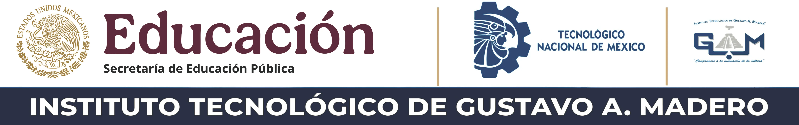

 

# 📚Desarrollo Web SSR - 2026A

Repositorio de la materia de Desarrollo Web SSR (Server Side Rendering)

## 📖Contenido

- Ramas de trabajo.
- Proyecto eje de la materia

## 🎯Objetivo

Documentar los sprints del proyecto que se desarrollara a lo largo del curso.

## 🌿Ramas del proyecto

- `dev`: Rama de desarrollo.
- `main`: Rama principal.

## 🔣Convenciones de Commits

|Código|Descripción|
|------|-----------|
|feat: ✨|Nueva fincionalidad|
|feat: 🐛|Correccion de errores|
|feat: 📄|Cambios de documentación|
|feat: 🎨|Cambio de aspecto visual|
|feat: ♻️|Refactorización de código|
|feat: ⚡|Mejoras de rendimiento|
|feat: ✅|Cambios en los test|
|feat: 🦴|Cambios en dependencia|
|feat: 🤖|Cambios en el CI/CD|
|feat: ⏪|Reversión de commits|

**Ejemplo** 
> feat ✨: Agrega automatización de usuarios

# 👤Autor

[Camila Arellano](https://github.com/MilaMellado)

